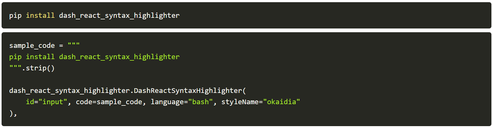

<p align="center">
	<h1 align="center"><b>Dash react-syntax-highlighter</b></h1>
	<p align="center">
		Beautiful syntax highlighting for your Dash apps.
    <br />
    <br />
    <br />
     
    <br />
    <b>  Made by <a href="https://ploomber.io">Ploomber</a> with ❤️</b>
    <br />
    <br />
    <i>~ Deploy your Dash application on <a href="https://ploomber.io">Ploomber.io</a> for free.~</i>
    <br />
  </p>
</p>
<br/>





<p align="center">
  <a href="https://dash_react_syntax_highlighter.ploomberapp.io/">Live demo - dash_react_syntax_highlighter.ploomberapp.io</a>
</p>

<br />
<br />

## Installation

```sh
pip install dash_react_syntax_highlighter
```

## Run demo locally

```sh
cd demo
pip install -r requirements.txt
python app.py
```

Open: http://localhost:8050


## Documentation


## Setup

```sh
npm install
pip install -r requirements.txt
pip install -r tests/requirements.txt
```

## Development

```sh
npm run build
python demo.py
```


## Release

```sh
# generate
npm run build
python setup.py sdist bdist_wheel
ls dist

# test artifact
pip install dash dist/dash_react_syntax_highlighter-0.0.1.tar.gz
python demo/app.py

# upload
pip install twine
twine upload dist/*

# clean up
rm -rf dist
```
